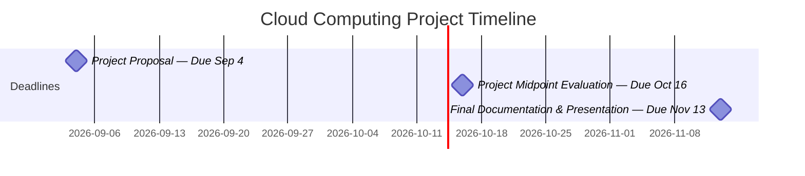

# Development Guidelines

This project follows the architecture documented in the repository.

Before beginning development, review:

```text
README.md
docs/
├── requirements.md
├── system-design.md
├── database-design.md
├── api-design.md
└── aws-architecture.md
```

The documents define the agreed system architecture and should be treated as the baseline for implementation.

## Before Starting a Task

1. Pull the latest version of `main`.
2. Create a feature branch for your task.
3. Read the relevant design documentation.
4. Check dependencies on other modules before changing shared models or interfaces.
5. Ask the project manager before making significant architectural changes.

Example:

```bash
git checkout main
git pull
git checkout -b feature/recipe-api
```

## What You Should Do

### Follow Module Boundaries

Backend functionality belongs in the appropriate Django app:

```text
apps/
├── users/
├── ingredients/
├── inventory/
├── recipes/
├── recommendations/
├── reviews/
└── shopping/
```

Do not place unrelated functionality inside another module simply because it is convenient.

### Keep Responsibilities Separated

Follow the general backend flow:

```text
Request
   ↓
View
   ↓
Serializer / Validation
   ↓
Service / Business Logic
   ↓
Model / Database
```

Views should primarily handle HTTP/API responsibilities.

Reusable or complex business logic should be placed in services rather than directly inside views.

### Reuse Shared Models

Use shared domain models instead of creating duplicate representations.

For example:

```text
                 Ingredient
                 /        \
                ▼          ▼
        InventoryItem   RecipeIngredient
```

Inventory and recipes should reference the shared canonical `Ingredient` model.

### Follow the API Contract

API endpoints should follow:

```text
docs/api-design.md
```

If an endpoint needs to change, discuss the change before modifying the shared API contract.

### Validate Input

Never assume frontend input is valid.

Validation and authorization must also occur on the backend.

### Add Tests

Important functionality should include appropriate tests.

At minimum, test:

- Expected successful behavior.
- Important validation failures.
- Permission/ownership behavior where applicable.

### Keep Commits Focused

Prefer commits that represent one understandable change.

Examples:

```text
Add Ingredient model
Add ingredient search endpoint
Add inventory API
Fix recipe serializer validation
```

Avoid combining unrelated features into one commit.

---

# What You Should NOT Do

## Do Not Redesign the Architecture Independently

Do not introduce major architectural changes without discussing them with the team.

Examples include:

- Replacing Django REST Framework.
- Replacing PostgreSQL.
- Changing authentication providers.
- Changing shared domain models in ways that affect other modules.
- Creating a second recommendation architecture.
- Changing established API contracts.
- Introducing new AWS infrastructure.

Suggest improvements first rather than implementing incompatible architecture directly.

## Do Not Duplicate Domain Models

Do not create separate ingredient representations such as:

```text
InventoryIngredient
RecipeIngredientName
RecommendationIngredient
ShoppingIngredient
```

when the shared `Ingredient` entity should be referenced.

For example:

```python
ingredient = models.ForeignKey(
    Ingredient,
    on_delete=models.CASCADE
)
```

## Do Not Put Business Logic in React

React should handle presentation and client-side interaction.

Core application rules belong in the backend.

For example, React should not independently calculate whether a recipe qualifies for `AVAILABLE_ONLY`.

Instead:

```text
React
   ↓
POST /api/recommendations/
   ↓
RecommendationService
   ↓
Result
```

## Do Not Duplicate Guest and User Logic

Guest and authenticated recommendation flows should share the same backend recommendation service.

```text
Guest Ingredients ──────┐
                         ├──→ RecommendationService
Saved User Inventory ────┘
```

## Do Not Hardcode Secrets

Never commit:

- Passwords.
- AWS credentials.
- Database credentials.
- API keys.
- Django secret keys.
- Authentication tokens.

Use environment variables or the documented configuration mechanism.

## Do Not Commit Local/Generated Files

Do not force-add files excluded by `.gitignore`, including:

```text
.venv/
.env
db.sqlite3
node_modules/
.DS_Store
```

## Do Not Push Feature Development Directly to `main`

Use a feature branch and pull request.

```text
main
  ↑
Pull Request
  ↑
feature/your-feature
```

## Do Not Implement Future Features Unless Assigned

The current priority is the MVP.

Features such as the following should not be implemented unless specifically assigned:

- AI-generated recipes.
- AI chatbot.
- Recipe image scanning.
- Advanced recommendation AI.
- Advanced customization.
- Other speculative features.

Reviews and shopping-list functionality are planned but are lower priority than the current core functionality.

## When Unsure

If your implementation would change:

- A shared model.
- An API contract.
- Authentication behavior.
- Recommendation behavior.
- Database relationships.
- AWS architecture.
- A module owned by another teammate.

Discuss the change with the team/project manager before implementing it.