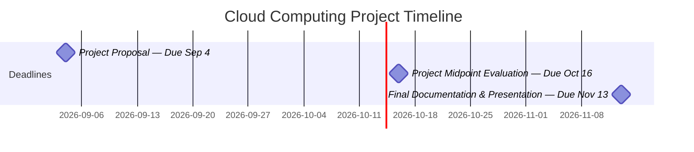

# Cloud Computing Project



# Recipe Suggestion App

## Overview

The Recipe Suggestion App is a cloud-based web application that helps users decide what to cook based on ingredients they already have.

Users can maintain a personal inventory of available ingredients and receive recipe suggestions that make use of those ingredients. Recommendations can also consider dietary preferences, allergies, cuisine preferences, and other user-defined filters.

The project aims to help users save time and money while reducing unnecessary food waste.

## Target Users

The primary target users are college students and individuals who want convenient and affordable meal ideas without spending significant time deciding what to cook or purchasing additional ingredients.

## Core Features

The application is planned to support:

* User account creation and authentication.
* Personalized user dashboard and logged-in experience.
* User profile, preferences, and allergy management.
* Personal ingredient inventory.
* Recipe recommendations based on available ingredients.
* Recipe search and filtering.
* Recipe display and cooking instructions.
* Manual recipe creation.
* Recipe reviews and ratings.
* Shopping list recommendations based on missing ingredients.
* Dietary, allergy, cuisine, vegan, halal, and similar filters.
* Recipe cost indicators.
* Administrative account functionality.
* Contact and customer support functionality.

### Potential / Future Features

The following features are being considered but are not currently part of the committed system design:

* AI-generated recipes.
* AI recipe assistant/chatbot.
* Recipe scanning and automatic ingredient extraction.
* Advanced interface customization.
* Additional intelligent recommendation features.

The scope and implementation of these features will be determined based on project progress, available resources, and technical feasibility.

## High-Level Architecture

The application will use a cloud-based client-server architecture.

```text
User
  │
  ▼
React Web Frontend
  │
  │ REST API
  ▼
Django REST Framework
  │
  ├── Authentication & User Management
  ├── Recipe Management
  ├── Ingredient Inventory
  ├── Recommendation System
  ├── Reviews
  └── Shopping Lists
        │
        ▼
  ┌───────────────┐
  │ Data & Media  │
  │    Storage    │
  └───────────────┘
```

The application will be deployed using Amazon Web Services (AWS).

## Technology Stack

| Component | Technology |
| --- | --- |
| Cloud Platform | AWS |
| Frontend | React |
| Frontend Hosting | Amazon S3 + CloudFront |
| Backend | Django + Django REST Framework |
| Backend Deployment | Docker containers on AWS |
| Database | PostgreSQL on Amazon RDS |
| Media Storage | Amazon S3 |
| Authentication | Amazon Cognito |
| API | REST |
| Version Control | Git / GitHub |

Detailed AWS infrastructure and deployment decisions are documented separately in the system design and AWS architecture documentation.

## Design Principles

The project will follow several core software design principles:

- **Object-Oriented and Component-Based Design:** The application will apply object-oriented design principles across both frontend and backend development. Backend functionality will use clearly defined models, services, and responsibilities, while the frontend will use reusable and encapsulated React components and modules.
- **Separation of Concerns:** Presentation, business logic, data access, and infrastructure responsibilities will remain separated.
- **Modularity:** Major application functionality will be divided into independent and reusable modules.
- **Reusability:** Common functionality and interface elements should be implemented as reusable components or services where appropriate.
- **Scalability:** Components should be designed so they can be expanded as application requirements grow.
- **Security:** Authentication, authorization, input validation, and secure credential management will be considered throughout development.
- **Cloud-Based Design:** AWS services will be used where appropriate to support deployment, storage, scalability, monitoring, and other application requirements.

## Project Documentation

Detailed technical documentation is maintained separately from this README:

```text
docs/
├── requirements.md
├── system-design.md
├── database-design.md
├── api-design.md
└── aws-architecture.md
```

The main README provides a high-level overview of the project, while the documents under `docs/` contain implementation-level requirements and design decisions.

## Project Structure

The planned repository structure is:

```text
cloud_computing_proj/
├── README.md
├── docs/
├── backend/
├── frontend/
├── infrastructure/
└── tests/
```

The structure may evolve as the system architecture and technology stack are finalized.
