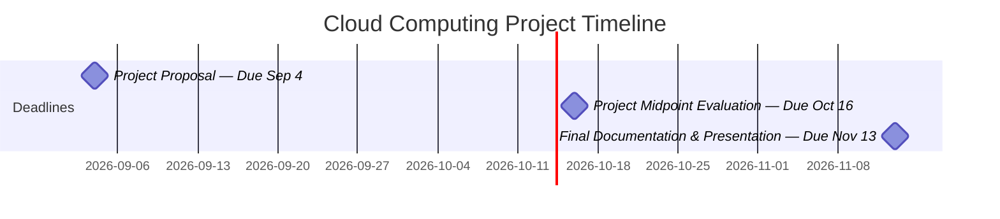

# Cloud Computing Project

# Features (planned)
- Dashboard (display recipes)
- Review section for each recipe
- Recipe display interface
- Manual input of available ingredients (groceries)
- Keep track of user's ingredients
- Recipe scanning for recording ingredients
- AI generated recipe
- Manual recipe creation (ingredients as tags)
- Filters for allegies/cuisine/vegan/halal/etc.
- Require to add allegies/preference to account -> automatically used as default filter
- Customization for interface
- AI chatbot for users who can't find recipe
- Account creation/management (user/admin)
- Shopping list recommendation (with sub-sections)
- Recipe lookup
- Contact us/customer service section
- How expensive the ingredients of a recipe is ==a> Tag features for recipe to allert users of allegies/vegan/halal recipe

# Later
- name
- logo
